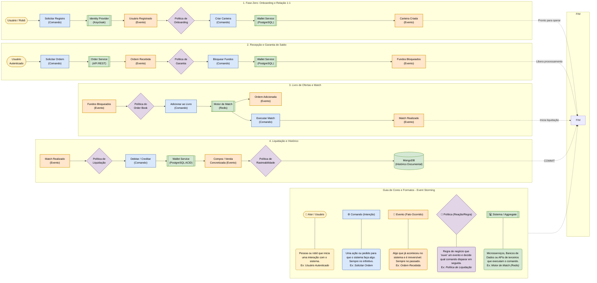

```mermaid
flowchart LR

    %% ==========================================
    %% DEFINIÇÃO DE CORES (PADRÃO EVENT STORMING)
    %% ==========================================
    classDef actor fill:#FFF2CC,stroke:#D6B656,stroke-width:2px,color:#000
    classDef command fill:#DAE8FC,stroke:#6C8EBF,stroke-width:2px,color:#000
    classDef event fill:#FFE6CC,stroke:#D79B00,stroke-width:2px,color:#000
    classDef system fill:#D5E8D4,stroke:#82B366,stroke-width:2px,color:#000
    classDef policy fill:#E1D5E7,stroke:#9673A6,stroke-width:2px,color:#000

 subgraph A_Legenda ["Guia de Cores e Formatos - Event Storming"]
        direction TB
        
        A(["👤 Ator / Usuário"]):::actor
        A_desc("Pessoa ou robô que inicia uma interação com o sistema.<br/>Ex: <i>Usuário Autenticado</i>"):::actor

        C["⚙️ Comando (Intenção)"]:::command
        C_desc("Uma ação ou pedido para que o sistema faça algo. Sempre no infinitivo.<br/>Ex: <i>Solicitar Ordem</i>"):::command

        E["🔔 Evento (Fato Ocorrido)"]:::event
        E_desc("Algo que já aconteceu no sistema e é irreversível. Sempre no passado.<br/>Ex: <i>Ordem Recebida</i>"):::event

        P{"🧠 Política (Reação/Regra)"}:::policy
        P_desc("Regra de negócio que 'ouve' um evento e decide qual comando disparar em seguida.<br/>Ex: <i>Política de Liquidação</i>"):::policy

        S[["💻 Sistema / Aggregate"]]:::system
        S_desc("Microsserviços, Bancos de Dados ou APIs de terceiros que executam o comando.<br/>Ex: <i>Motor de Match (Redis)</i>"):::system

        %% Organização invisível para alinhar os blocos lado a lado
        A --- A_desc
        C --- C_desc
        E --- E_desc
        P --- P_desc
        S --- S_desc
    end

    %% ==========================================
    %% 1. FASE ZERO: ONBOARDING
    %% ==========================================
    subgraph Fase1 ["1. Fase Zero: Onboarding e Relação 1:1"]
        direction LR
        A1(["Usuário / Robô"]):::actor
        C1["Solicitar Registro<br/>(Comando)"]:::command
        S1[["Identity Provider<br/>(Keycloak)"]]:::system
        E1["Usuário Registrado<br/>(Evento)"]:::event
        P1{"Política de<br/>Onboarding"}:::policy
        C2["Criar Carteira<br/>(Comando)"]:::command
        S2[["Wallet Service<br/>(PostgreSQL)"]]:::system
        E2["Carteira Criada<br/>(Evento)"]:::event

        A1 --> C1 --> S1 --> E1
        E1 --> P1 --> C2 --> S2 --> E2
    end

    %% ==========================================
    %% 2. FASE UM: INTENÇÃO E GARANTIA
    %% ==========================================
    subgraph Fase2 ["2. Recepção e Garantia de Saldo"]
        direction LR
        A2(["Usuário<br/>Autenticado"]):::actor
        C3["Solicitar Ordem<br/>(Comando)"]:::command
        S3[["Order Service<br/>(API REST)"]]:::system
        E3["Ordem Recebida<br/>(Evento)"]:::event
        P2{"Política de<br/>Garantia"}:::policy
        C4["Bloquear Fundos<br/>(Comando)"]:::command
        S4[["Wallet Service<br/>(PostgreSQL)"]]:::system
        E4["Fundos Bloqueados<br/>(Evento)"]:::event

        A2 --> C3 --> S3 --> E3
        E3 --> P2 --> C4 --> S4 --> E4
    end

    %% ==========================================
    %% 3. FASE DOIS: MOTOR DE MATCH
    %% ==========================================
    subgraph Fase3 ["3. Livro de Ofertas e Match"]
        direction LR
        E4_ref["Fundos Bloqueados<br/>(Evento)"]:::event
        P3{"Política do<br/>Order Book"}:::policy
        C5["Adicionar ao Livro<br/>(Comando)"]:::command
        S5[["Motor de Match<br/>(Redis)"]]:::system
        E5["Ordem Adicionada<br/>(Evento)"]:::event
        C6["Executar Match<br/>(Comando)"]:::command
        E6["Match Realizado<br/>(Evento)"]:::event

        E4_ref --> P3 --> C5 --> S5 --> E5
        S5 --> C6 --> E6
    end

    %% ==========================================
    %% 4. FASE TRÊS: LIQUIDAÇÃO (SETTLEMENT)
    %% ==========================================
    subgraph Fase4 ["4. Liquidação e Histórico"]
        direction LR
        E6_ref["Match Realizado<br/>(Evento)"]:::event
        P4{"Política de<br/>Liquidação"}:::policy
        C7["Debitar / Creditar<br/>(Comando)"]:::command
        S6[["Wallet Service<br/>(PostgreSQL ACID)"]]:::system
        E7["Compra / Venda<br/>Concretizada (Evento)"]:::event
        P5{"Política de<br/>Rastreabilidade"}:::policy
        S7[("MongoDB<br/>(Histórico Documental)")]:::system

        E6_ref --> P4 --> C7 --> S6 --> E7
        E7 --> P5 --> S7
    end

    subgraph ENDFASE ["FIM"]
     END_ref["FIM"]
    end


    %% Conexões entre as fases para dar continuidade visual
    A_Legenda -.-> END_ref
    E2 -.->|"Pronto para operar"| END_ref
    E4 -.->|"Libera processamento"| END_ref
    E6 -.->|"Inicia liquidação"| END_ref
    S7 -.->|"COMMIT"| END_ref
```