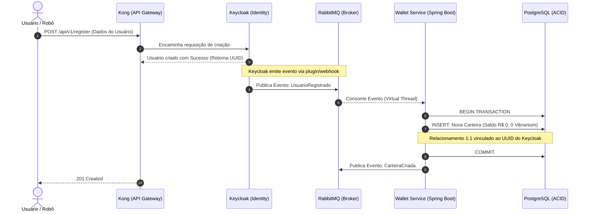
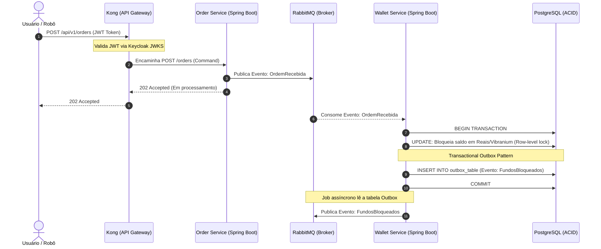
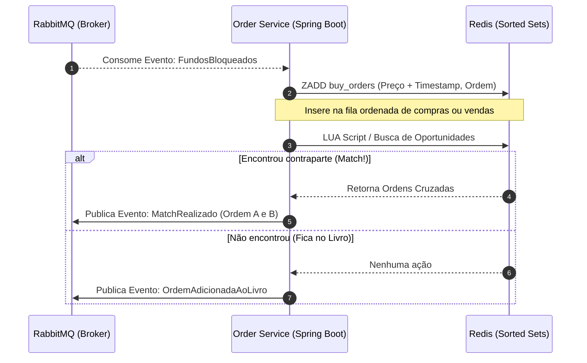
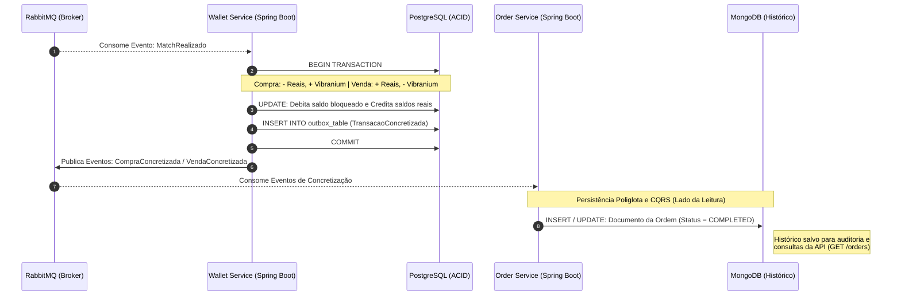

### 1. Fase Zero: Onboarding e Relação 1:1

Neste fluxo, mostramos como um usuário é criado e como a sua carteira nasce zerada no banco relacional.

---

### 2. Fase Um: Intenção de Ordem e Garantia de Saldo

O usuário quer comprar ou vender. Precisamos garantir que ele está autenticado e que tem saldo suficiente antes de enviar a ordem para o motor de match.

*Nota: Aqui aplicamos o padrão **Transactional Outbox** no PostgreSQL para não perder eventos.*

---

### 3. Fase Dois: Motor de Match (Livro de Ofertas)

Com o saldo garantido, a ordem vai para o cérebro da operação: o **Redis**. Usamos as *Sorted Sets* do Redis porque elas ordenam as ofertas por preço e tempo na velocidade da memória RAM.

---

### 4. Fase Três: Liquidação (Settlement) e Histórico

O match aconteceu! Agora precisamos consolidar os saldos e guardar o histórico inviolável para rastreabilidade (CQRS).

### 💡 Dicas de Leitura para a Equipe:

1. **Kong + Keycloak:** Eles retiram o peso de autenticação dos microsserviços de negócio. O *Order* e o *Wallet* já recebem a requisição sabendo que o usuário existe e é válido.
2. **RabbitMQ no Centro:** Note como quase todas as passagens de bastão passam pelo RabbitMQ. Isso garante que, se o serviço *Wallet* cair sob o pico de 5000 requests/s, o RabbitMQ segura os eventos na fila até ele voltar (Resiliência).
3. **Bancos Diferentes (Poliglota):** O PostgreSQL (ACID) cuida exclusivamente do dinheiro (para não sumir um centavo), enquanto o MongoDB guarda os documentos complexos (JSON) das ordens e o Redis faz a matemática rápida do cruzamento.