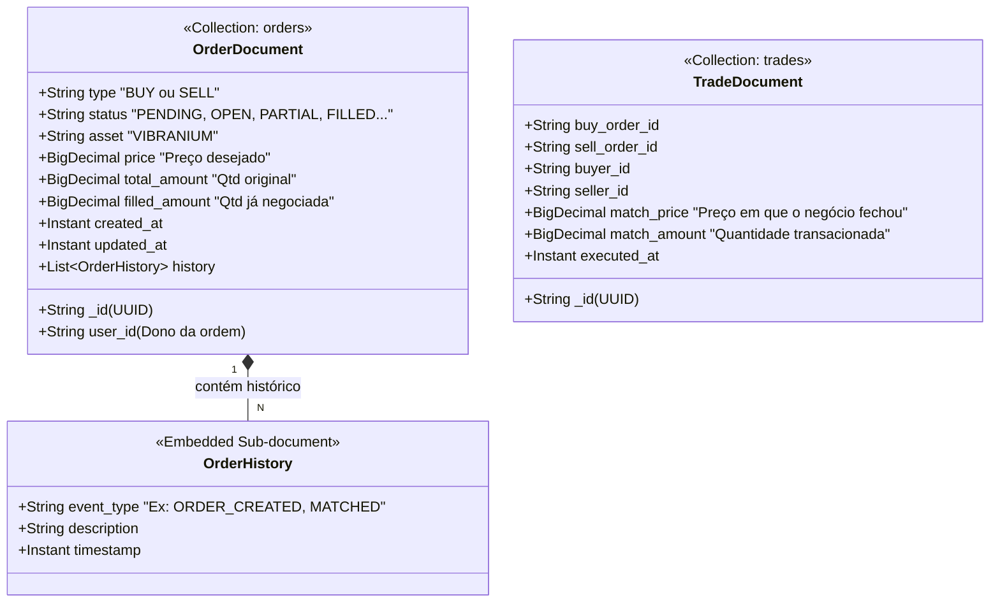
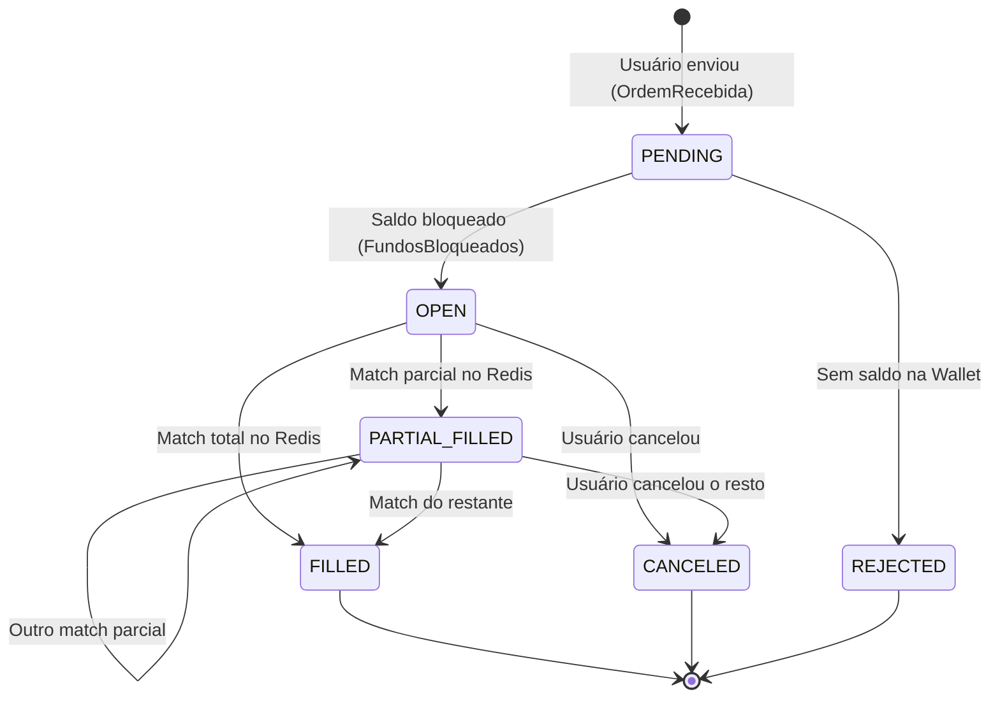

# 🍃 Modelagem de Banco de Dados: Microsserviço Order (MongoDB)

Bem-vindo ao coração do Livro de Ofertas! O microsserviço `order-service` é responsável por receber as intenções de compra e venda de Vibranium dos usuários.

Como o nosso motor de *match* roda na memória RAM (Redis) para suportar até 5000 trades por segundo, nós utilizamos o **MongoDB** como nossa base de Leitura (Read Model) e Histórico.

No MongoDB, não temos "Tabelas" e "Linhas", mas sim **Coleções (Collections)** e **Documentos (Documents)** no formato JSON. Isso é perfeito porque podemos salvar uma ordem e todo o seu histórico de eventos dentro de um único arquivo rápido de ler!

## 📊 Estrutura dos Documentos (JSON Schema)

Diferente de um banco relacional, no Mongo nós *embutimos* (embed) dados que são lidos juntos.

---

## 🗂️ Dicionário de Dados (As Coleções)

### 1. Coleção `orders` (As Intenções)

Esta coleção guarda a "foto" atualizada de cada ordem que entra no sistema.

* **`total_amount` vs `filled_amount`:** Uma ordem de compra de 100 Vibranium pode encontrar um vendedor que só tem 40. O `total_amount` será 100, e o `filled_amount` passará a ser 40. A ordem continua aberta no Livro aguardando os 60 restantes!
* 
**O array `history` (O Pulo do Gato):** Para garantir a rastreabilidade pedida, em vez de criar uma tabela separada e fazer `JOIN`, nós salvamos um array de eventos *dentro* do próprio documento da ordem. Quando o Frontend pedir os detalhes da ordem, o Mongo devolve a ordem inteira e a linha do tempo de tudo o que aconteceu com ela em apenas **uma** consulta ultrarrápida.

### 2. Coleção `trades` (Os Negócios Fechados)

Sempre que o Motor de Match (Redis) cruza duas ordens, nós geramos um "Trade".

* **Para que serve:** Esta coleção é o comprovante definitivo de que uma compra/venda ocorreu. É daqui que podemos gerar gráficos de *Candlestick* (velas de alta e baixa de preço) para a plataforma de ecommerce, pois temos o `match_price` e o `executed_at` exatos de cada negócio.

---

## 🚦 A Máquina de Estados da Ordem (Para Juniores)

O campo `status` do `OrderDocument` não muda de forma aleatória. Ele segue um ciclo de vida rígido governado pelos nossos eventos do RabbitMQ.

Entender essa "Máquina de Estados" é fundamental para debugar o sistema:

### 💡 Como o CQRS funciona aqui na prática?

1. O usuário manda um POST para criar uma Ordem. Esse comando vai validar regras e pedir para a **Wallet** (PostgreSQL) bloquear os reais.

2. Se a Wallet aprovar, a ordem entra no **Redis** (onde ocorre a concorrência e o Livro de Ofertas real).

3. Em *background*, um evento avisa o nosso serviço: *"Ei, a ordem do usuário entrou no Livro!"*.
4. Nosso código escuta esse evento e salva um `OrderDocument` com status `OPEN` no **MongoDB**.
5. Segundos depois, o usuário abre o aplicativo e puxa a tela (GET `/orders`). O sistema **NÃO** vai perguntar para o Redis e nem para o Postgres. Ele vai fazer uma busca simples no **MongoDB**, que é desenhado especificamente para cuspir esses dados de leitura quase instantaneamente!
