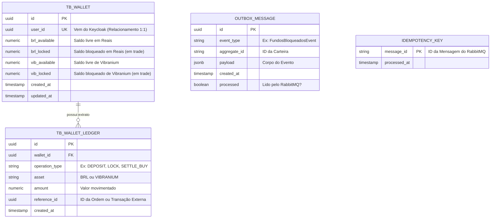

# 💾 Modelagem de Banco de Dados: Microsserviço Wallet (PostgreSQL)

Neste documento, vamos detalhar a estrutura de tabelas do microsserviço `wallet-service`. Como este serviço é o **Guardião do Dinheiro**, nós utilizamos o PostgreSQL para garantir consistência ACID e evitar que qualquer usuário gaste mais do que possui.

O desafio nos pede para controlar o "saldo em reais, a quantidade de Vibranium (em unidades) e demais valores". Além disso, como o Livro de Ofertas funciona de forma assíncrona, precisamos distinguir os valores "em trade" dos valores já efetivados.

## 📊 Diagrama Entidade-Relacionamento (ER)



---

## 🗂️ Dicionário de Dados (As Tabelas)

### 1. `tb_wallet` (A Carteira Principal)

Esta é a tabela principal. Ela guarda o estado atual de riqueza do usuário.

* **`user_id` (Unique):** Garante a nossa regra de negócio de que um usuário do Keycloak só pode ter exatamente UMA carteira.
* 
**A separação de saldos:** Para atender à regra de distinguir valores efetuados de valores "em trade", nós dividimos o saldo em dois:


* `brl_available` / `vib_available`: O que o usuário pode sacar ou usar para criar *novas* ordens.
* `brl_locked` / `vib_locked`: O dinheiro ou Vibranium que está "congelado" aguardando o Motor de Match (Redis) cruzar a oferta.


* **🔒 Regra de Ouro (Constraint):** No banco de dados, teremos uma restrição (`CHECK (brl_available >= 0)`) para que o banco lance um erro fatal caso um bug no código tente negativar o saldo.

### 2. `tb_wallet_ledger` (O Extrato Interno)

Sempre que alteramos o saldo da `tb_wallet`, inserimos uma linha aqui. Isso serve para auditoria interna financeira. Se o saldo do usuário for R$ 100, a soma das operações nesta tabela para aquele `wallet_id` deve resultar em exatamente R$ 100.

### 3. `outbox_message` (A Fila de Saída Segura)

Lembra que o nosso sistema precisa ser resiliente e tolerante a falhas?. O **Transactional Outbox Pattern** resolve o problema de "salvei no banco, mas a internet caiu antes de mandar para o RabbitMQ".

* **Como funciona:** Quando bloqueamos o saldo do usuário, na **mesma transação do Postgres**, inserimos uma linha nesta tabela contendo o evento (ex: `FundosBloqueadosEvent` em formato JSON). Um *Job* (rotina de fundo) fica lendo essa tabela a cada segundo e empurrando essas mensagens para o RabbitMQ com segurança.

### 4. `idempotency_key` (O Escudo contra Duplicação)

Se o RabbitMQ tiver um soluço, ele pode entregar a mensagem de "Match Realizado" duas vezes para a mesma carteira.

* 
**Como funciona:** Antes de processar qualquer liquidação (adicionar Vibranium e tirar reais), o sistema tenta gravar o `message_id` (o ID único do evento) nesta tabela. Se o banco disser "Erro, essa chave primária já existe", o sistema sabe que já processou essa mensagem e ignora a duplicata. Isso garante a Idempotência!


---

## 🛠️ Como isso funciona na prática? (Exemplo de Concorrência para Juniores)

O desafio alerta que a performance e a concorrência devem ser muito bem pensadas, já que milhares de usuários usarão robôs freneticamente.

Como evitamos que dois robôs da mesma pessoa gastem o mesmo saldo ao mesmo tempo? Usando o bloqueio pessimista do banco (`Pessimistic Locking`).

Quando o Spring Boot vai bloquear fundos, ele executa esta query mágica:

```sql
SELECT * FROM tb_wallet 
WHERE id = '123-abc' 
FOR UPDATE; -- <== A mágica acontece aqui!

```

O comando `FOR UPDATE` diz ao PostgreSQL: *"Tranque esta linha. Se outra Thread do Java tentar ler esta mesma carteira agora, mande ela esperar eu terminar"*.

Assim, nós atualizamos o saldo com segurança, inserimos o evento na `outbox_message` e fazemos o `COMMIT`. Apenas nesse momento a linha é destrancada para o próximo robô!