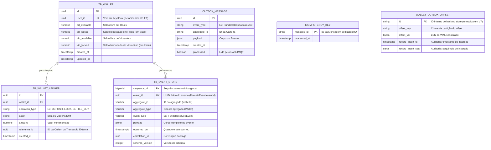

# 💾 Modelagem de Banco de Dados: Microsserviço Wallet (PostgreSQL)

Neste documento, vamos detalhar a estrutura de tabelas do microsserviço `wallet-service`. Como este serviço é o **Guardião do Dinheiro**, nós utilizamos o PostgreSQL para garantir consistência ACID e evitar que qualquer usuário gaste mais do que possui.

O desafio nos pede para controlar o "saldo em reais, a quantidade de Vibranium (em unidades) e demais valores". Além disso, como o Livro de Ofertas funciona de forma assíncrona, precisamos distinguir os valores "em trade" dos valores já efetivados.

## 📊 Diagrama Entidade-Relacionamento (ER)



---

## 🗂️ Dicionário de Dados (As Tabelas)

### 1. `tb_wallet` (A Carteira Principal)

Esta é a tabela principal. Ela guarda o estado atual de riqueza do usuário.

* **`user_id` (Unique):** Garante a nossa regra de negócio de que um usuário do Keycloak só pode ter exatamente UMA carteira.
* 
**A separação de saldos:** Para atender à regra de distinguir valores efetuados de valores "em trade", nós dividimos o saldo em dois:


* `brl_available` / `vib_available`: O que o usuário pode sacar ou usar para criar *novas* ordens.
* `brl_locked` / `vib_locked`: O dinheiro ou Vibranium que está "congelado" aguardando o Motor de Match (Redis) cruzar a oferta.


* **🔒 Regra de Ouro (Constraint):** No banco de dados, teremos uma restrição (`CHECK (brl_available >= 0)`) para que o banco lance um erro fatal caso um bug no código tente negativar o saldo.

### 2. `tb_wallet_ledger` (O Extrato Interno)

Sempre que alteramos o saldo da `tb_wallet`, inserimos uma linha aqui. Isso serve para auditoria interna financeira. Se o saldo do usuário for R$ 100, a soma das operações nesta tabela para aquele `wallet_id` deve resultar em exatamente R$ 100.

### 3. `outbox_message` (A Fila de Saída Segura)

Lembra que o nosso sistema precisa ser resiliente e tolerante a falhas?. O **Transactional Outbox Pattern** resolve o problema de "salvei no banco, mas a internet caiu antes de mandar para o RabbitMQ".

* **Como funciona:** Quando bloqueamos o saldo do usuário, na **mesma transação do Postgres**, inserimos uma linha nesta tabela contendo o evento (ex: `FundosBloqueadosEvent` em formato JSON). Um *Job* (rotina de fundo) fica lendo essa tabela a cada segundo e empurrando essas mensagens para o RabbitMQ com segurança.

### 4. `idempotency_key` (O Escudo contra Duplicação)

Se o RabbitMQ tiver um soluço, ele pode entregar a mensagem de "Match Realizado" duas vezes para a mesma carteira.

* 
**Como funciona:** Antes de processar qualquer liquidação (adicionar Vibranium e tirar reais), o sistema tenta gravar o `message_id` (o ID único do evento) nesta tabela. Se o banco disser "Erro, essa chave primária já existe", o sistema sabe que já processou essa mensagem e ignora a duplicata. Isso garante a Idempotência!

### 5. `wallet_outbox_offset` (Histórico — Removida em V7)

Tabela criada nas migrations V5 e V6 para persistir a posição de leitura (LSN do WAL) do relay CDC. Com a migração para Polling SKIP LOCKED, o relay passou a usar `processed = false` para selecionar mensagens pendentes, tornando esta tabela desnecessária. Foi removida pela migration `V7__drop_wallet_outbox_offset.sql`.

* **Colunas principais:** `id` (PK do backing store), `offset_key` (chave de partição), `offset_val` (LSN persistido).
* **Colunas de auditoria:** `record_insert_ts` (timestamp) e `record_insert_seq` (sequência SERIAL) para diagnóstico operacional.

### 6. `tb_event_store` (O Registro Imutável — Introduzido em V8)

Tabela **append-only** que persiste todos os eventos de domínio do wallet-service para auditoria, compliance e replay temporal. Complementa a `outbox_message` (que garante delivery ao RabbitMQ) com um registro **permanente e inviolável**.

> **Referência arquitetural:** Mesma estratégia do order-service (AT-14) — consistência entre microserviços. Ver [ddd-cqrs-event-source.md, seção 2.2](../architecture/ddd-cqrs-event-source.md#22-event-store-postgresql--auditoria-e-compliance-at-14).

**Schema:**
```sql
CREATE TABLE tb_event_store (
    sequence_id     BIGSERIAL    PRIMARY KEY,    -- Sequência monotônica global
    event_id        UUID         NOT NULL UNIQUE, -- Deduplicação (DomainEvent.eventId)
    aggregate_id    VARCHAR(255) NOT NULL,        -- Ex: walletId (UUID como string)
    aggregate_type  VARCHAR(100) NOT NULL,        -- "Wallet"
    event_type      VARCHAR(150) NOT NULL,        -- Ex: "FundsReservedEvent"
    payload         JSONB        NOT NULL,        -- Corpo completo serializado
    occurred_on     TIMESTAMPTZ  NOT NULL,        -- Timestamp UTC do fato
    correlation_id  UUID         NOT NULL,        -- Correlação da Saga
    schema_version  INTEGER      NOT NULL DEFAULT 1  -- Evolução backward-compatible
);
```

**Índices:**
| Índice | Colunas | Propósito |
|--------|---------|-----------|
| `idx_event_store_aggregate_replay` | `(aggregate_id, sequence_id)` | Replay eficiente por agregado |
| `idx_event_store_event_type` | `(event_type)` | Consulta por tipo de evento |
| `idx_event_store_correlation` | `(correlation_id)` | Rastreabilidade de Saga |

**Proteção de Imutabilidade (Triggers):**
```sql
-- Rejeita UPDATE
CREATE TRIGGER trg_event_store_deny_update
    BEFORE UPDATE ON tb_event_store
    FOR EACH ROW EXECUTE FUNCTION fn_event_store_deny_update();

-- Rejeita DELETE
CREATE TRIGGER trg_event_store_deny_delete
    BEFORE DELETE ON tb_event_store
    FOR EACH ROW EXECUTE FUNCTION fn_event_store_deny_delete();
```

Ambas as funções lançam `RAISE EXCEPTION 'Event Store is append-only: ... not allowed'`, impedindo qualquer alteração no nível do banco de dados, independente da camada de aplicação.

**Diferença entre Outbox e Event Store:**

| Aspecto | `outbox_message` | `tb_event_store` |
|---------|-------------------|------------------|
| **Propósito** | Garantir delivery ao RabbitMQ | Registro permanente para auditoria |
| **Ciclo de vida** | Transiente (DELETE após publicação) | Permanente (append-only) |
| **Mutabilidade** | UPDATE `processed=true` + DELETE periódico | **NUNCA** (triggers bloqueiam) |
| **Consulta típica** | Polling interno (mensagens pendentes) | Replay temporal por aggregateId |
| **Compliance** | NÃO — registros são apagados | SIM — imutável, pronto para auditoria |

**Mapeamento de Operações Wallet → Eventos:**

| Operação do WalletService | Evento Gravado |
|---------------------------|----------------|
| `createWallet()` | `WalletCreatedEvent` |
| `reserveFunds()` — sucesso | `FundsReservedEvent` |
| `reserveFunds()` — falha | `FundsReservationFailedEvent` |
| `releaseFunds()` — sucesso | `FundsReleasedEvent` |
| `releaseFunds()` — falha | `FundsReleaseFailedEvent` |
| `settleFunds()` — sucesso | `FundsSettledEvent` |
| `settleFunds()` — falha | `FundsSettlementFailedEvent` |

> **Atomicidade:** Os três registros (saldo + outbox + event store) são persistidos na **mesma transação ACID** do PostgreSQL. Se qualquer um falhar, tudo é revertido.


---

## 🛠️ Como isso funciona na prática? (Exemplo de Concorrência para Juniores)

O desafio alerta que a performance e a concorrência devem ser muito bem pensadas, já que milhares de usuários usarão robôs freneticamente.

Como evitamos que dois robôs da mesma pessoa gastem o mesmo saldo ao mesmo tempo? Usando o bloqueio pessimista do banco (`Pessimistic Locking`).

Quando o Spring Boot vai bloquear fundos, ele executa esta query mágica:

```sql
SELECT * FROM tb_wallet 
WHERE id = '123-abc' 
FOR UPDATE; -- <== A mágica acontece aqui!

```

O comando `FOR UPDATE` diz ao PostgreSQL: *"Tranque esta linha. Se outra Thread do Java tentar ler esta mesma carteira agora, mande ela esperar eu terminar"*.

Assim, nós atualizamos o saldo com segurança, inserimos o evento na `outbox_message` e fazemos o `COMMIT`. Apenas nesse momento a linha é destrancada para o próximo robô!