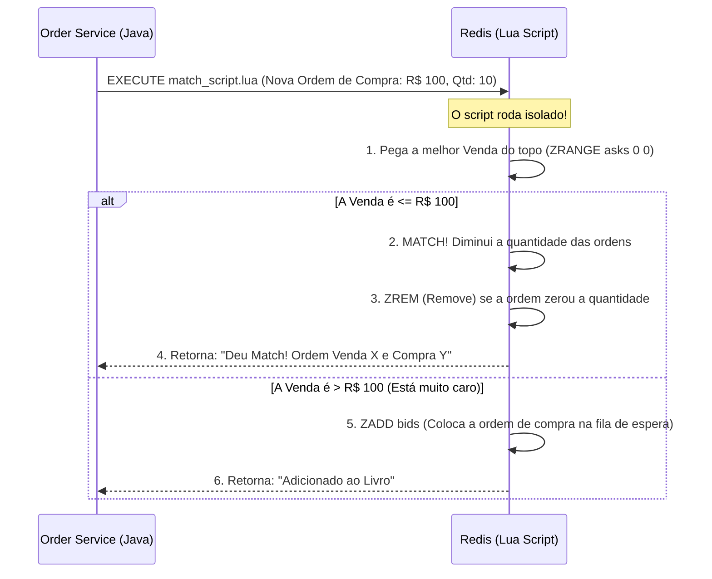

# ⚡ Motor de Match: O Cérebro do Livro de Ofertas (Redis)

Bem-vindo ao núcleo do nosso MVP de negociação de Vibranium!

Se milhares de usuários e robôs podem colocar uma ordem no mesmo milésimo de segundo, como garantimos que o sistema não processe compras e vendas erradas ou trave o banco de dados?

A resposta é o **Redis** utilizando **Sorted Sets (Conjuntos Ordenados)** e **Lua Scripts**. Vamos entender como essa mágica acontece na memória RAM!

---

## 1. Por que o Redis? (O Fim do Problema de Concorrência)

Em bancos de dados tradicionais (como o PostgreSQL), para evitar que dois robôs comprem a mesma oferta, nós precisamos usar "Locks" (trancas), o que deixa o sistema lento.

O Redis é **Single-Threaded** (possui um único fio de execução). Isso significa que ele processa os comandos em fila indiana, um por vez, na velocidade da memória RAM (microssegundos). Como ele faz uma coisa de cada vez de forma absurdamente rápida, o problema de "concorrência simultânea cruzando a mesma ordem" simplesmente deixa de existir! Atendemos exatamente à premissa de que o Livro não admite concorrência na hora do *match*.

## 2. A Estrutura: Sorted Sets (`ZSET`)

No Redis, não salvamos JSONs complexos ou tabelas. Usamos uma estrutura chamada `ZSET`.
Um `ZSET` guarda uma lista de `Strings` (o ID da Ordem), mas cada String tem um **Score (Pontuação)**. O Redis automaticamente, e de forma instantânea, mantém essa lista ordenada pela pontuação.

Para um Livro de Ofertas funcionar, precisamos de duas filas (`ZSETs`):

1. `orderbook:vibranium:bids` 🟢 (Fila de quem quer **COMPRAR**)
2. `orderbook:vibranium:asks` 🔴 (Fila de quem quer **VENDER**)

---

## 3. A Regra de Ouro: Prioridade de Preço e Tempo

No mercado financeiro, existe uma regra universal para cruzar ordens:

1. **Preço:** Quem paga mais caro tem prioridade na compra. Quem vende mais barato tem prioridade na venda.
2. **Tempo:** Se duas pessoas oferecem o mesmo preço, quem chegou primeiro leva.

Como transformamos "Preço" e "Tempo" em um único número (`Score`) para o Redis ordenar? Usando uma fórmula matemática simples no Spring Boot antes de enviar para o Redis!

### 🔴 Para Vendas (Asks) - Queremos o Menor Preço Primeiro

O Redis ordena do menor Score para o maior.

* **Fórmula:** `Score = Preço + (Timestamp / 1.000.000.000.000)`
* *Exemplo:* Vendo a R$ 100,00. Cheguei no instante 1700000000000.
* *Score no Redis:* `100.0017`
* Se outro robô vender a R$ 100,00 um segundo depois, o score dele será `100.0018`. O Redis coloca o `100.0017` no topo da fila, respeitando o tempo!

### 🟢 Para Compras (Bids) - Queremos o Maior Preço Primeiro

Como o Redis ordena do menor para o maior, nós **invertemos** o preço (deixamos negativo).

* **Fórmula:** `Score = -Preço + (Timestamp / 1.000.000.000.000)`
* *Exemplo:* Compro a R$ 100,00. Cheguei no instante 1700000000000.
* *Score no Redis:* `-100.00` + `0.0017` = `-99.9983`
* Se alguém quiser comprar a R$ 110,00, o score será `-109.99...`. O número -109 é menor que -99, então a oferta de R$ 110 vai direto para o topo da fila!

---

## 4. O Fluxo do Match (Lua Script)

O "Match" é o momento em que a compra e a venda se encontram. Para garantir que nada falhe, não podemos puxar os dados pro Java, calcular e mandar de volta pro Redis (a rede adiciona atraso e risco).

Nós escrevemos um pequeno script na linguagem **Lua** e enviamos para rodar *dentro* do próprio Redis. O script Lua é atômico (ninguém interrompe ele).

### O Que o Java (Spring Boot) faz depois?

Se o Redis responder *"Deu Match!"*, o nosso serviço Java cria um evento `MatchRealizadoEvent` e joga no **RabbitMQ**. A partir daí, a nossa arquitetura de *Event Sourcing* assume: o Microsserviço de `Wallet` consome a mensagem e debita/credita os Reais e Vibranium no PostgreSQL.

### Resumo de Design

Ao usar o Redis desta forma, nós cumprimos todos os requisitos do desafio:

* 
**Escala:** Suporta facilmente mais de 5000 requisições por segundo.

* 
**Sem concorrência perigosa:** O modelo Single-Thread do Redis + Lua Scripts garante precisão matemática.

* 
**MVP Focado:** Focamos em processar as intenções rapidamente, delegando os saldos e o registro das operações para serviços separados e bases apropriadas.